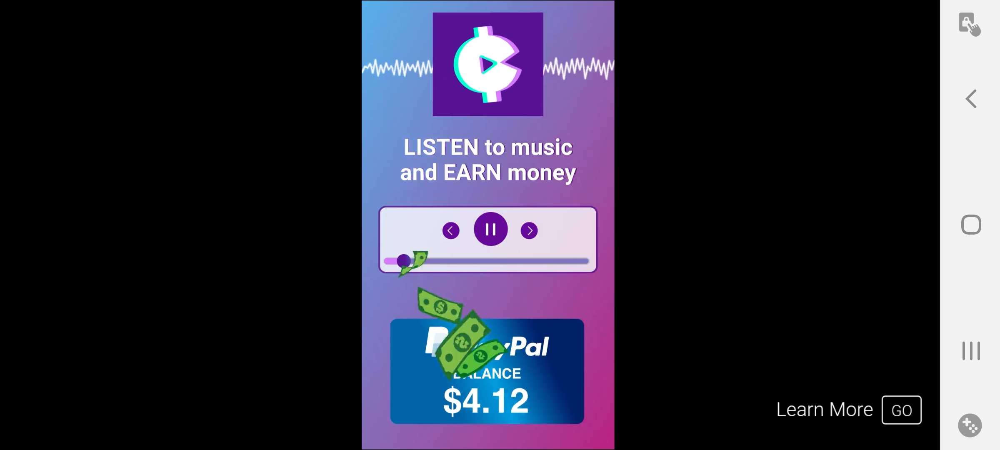
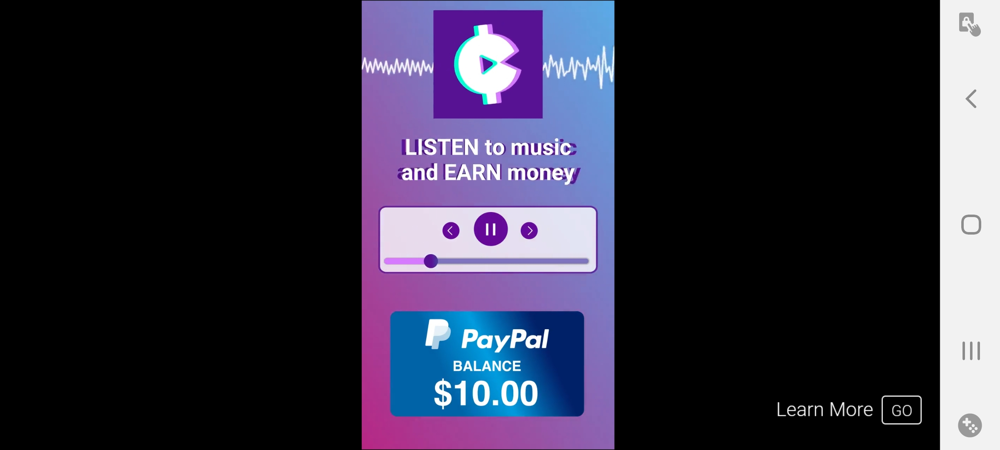
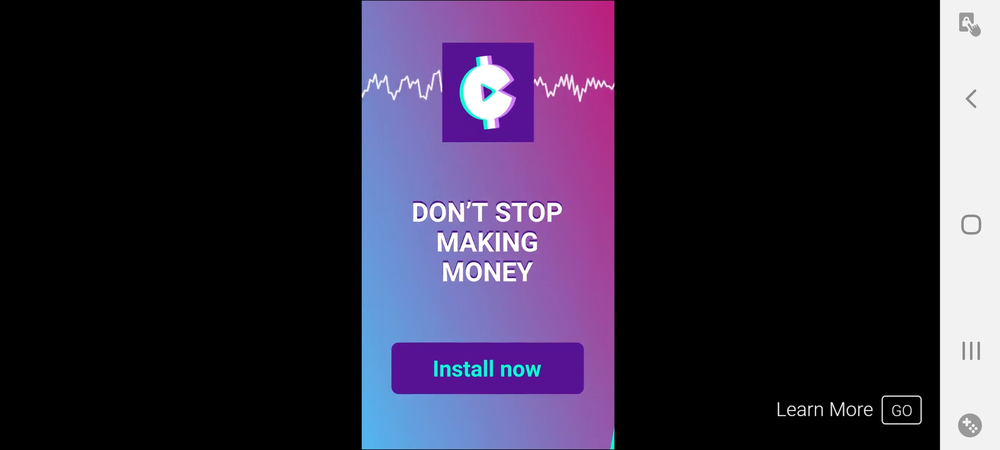
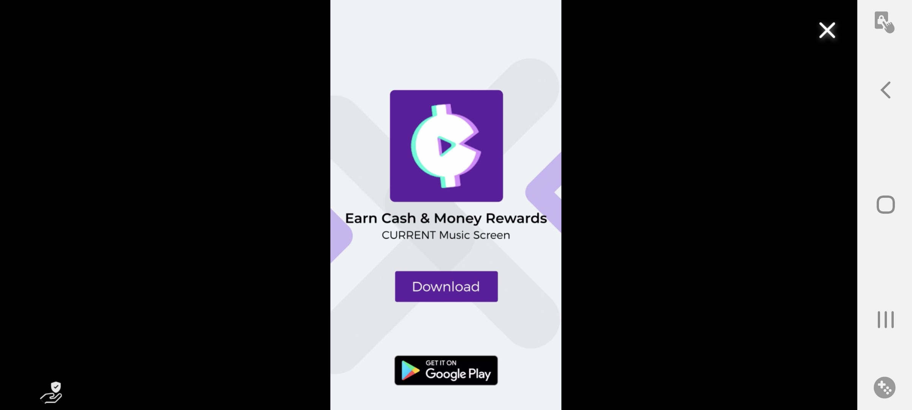

***

# Virus definition: Current (Android App)

**Linux defender ID:** `ANDROID:X00000001`

**Severity level:** `0.8/10.0 to 1.5/10.0`

**Virus type:** `malware, hijacker, adware`

**Other terms:** `free money scam, free giftcard scam`

**Developer:** [Current Rewards: Earn Cash Gifts Free Music Player](https://play.google.com/store/apps/developer?id=Current+Rewards:+Earn+Cash+Gifts+Free+Music+Player)

**Link to the virus** _(as of December 23rd 2020, it is still up):_ [https://play.google.com/store/apps/details?id=us.current.android&hl=en_US&gl=US](https://play.google.com/store/apps/details?id=us.current.android&hl=en_US&gl=US)

**Affected versions:** `Android 6.x, Android 7.x, Android 8.x, Android 9.x, Android 10.x, Android 11.x`

## Info

**Current** is an app that claims to let you earn money by listening to music. The app is sketchy, and typically trashes the reward as you get closed to it.

If you have developer options/settings turned on, the app will not let you use it until you turn them off. This is very sketchy, and is a violation of Google Play policy.

Once you turn developer options/settings off, the app will hijack your developer settings and not let you turn them back on until you delete the app. No legitimate app should be able to do this. The only malicious action is the hijacking of your developer settings. The app spews out annoying notifications as well, but doesn't cause harm other than this. When the app is closed, it won't re-open itself without you re-opening it, nor will it try to interfere with other apps. The developer settings can only be turned back on after uninstalling Current. It is pretty easy to do so.

Current really isn't worth your time. Trust me, I tested it. It isn't very hard to remove, it doesn't block uninstallation, so all you have to do is uninstall it.

## How to remove

A reminder of how to uninstall apps on Android:

1. Hold down on the app icon with your finger

2. Click the delete option

3. Click "yes" on the `Are you sure you want to uninstall this app` dialog

4. You have successfully uninstalled the app.,

The app does not try to block uninstallation. It may leave some bad things behind, so try restarting your phone afterwards.

## How to turn developer settings back on

Here is how to turn developer settings/options back on:

1. Go to your phones about page under settings

2. Find the button with your Android version

3. Click/tap this button really fast 3-5 times

4. Developer options have now been re-enabled

## As a bad advertiser

Alongside in-game currency offers, current also shows up in Google Play advertisements. Just like most of the other top apps, the people behind current use bad methods to reach their consumers.

[Current using people who lost their jobs during the COVID-19 pandemic as a reason to use their app](Screenshot_20201228-142243_Pocket Trains.jpg)

This is what the ad looks like:

**Beginning, using peoples suffering for their own gain**

Casual money scam

Casual gift card scam

Claiming that "you won't stop making money"

Ad title screen from Google Play

There are a lot of other bad advertisers out there, current is another one of them that will go to any length to scam more of its users.

## Side comment

I knew this was a scam based on previous ads. The time I installed this malware was when I was trying to get lots of free gold on AdVenture Capitalist (back when I didn't know better) I turned off my developer settings, as I really wanted the 140+ gold. I later removed it, and never got the reward, despite reaching the criteria.

Despite Google's claims of there "being a much higher chance of a meteor hitting the Earth than getting malware from Google Play" you can still easily get malware on Google Play. There is tons of it. Unfortunately, this one managed to get into the spotlight and stay in the spotlight, likely causing many, many more copycats to be made. Try to avoid apps that claim to "let you earn gift cards/money by playing games/listening to music/doing x" they are all scams. It is a bad trend that has been going strong for over a year now. It is not a sustainable business model, and anyone doing it is scamming you.

When I saw another current ad while playing Pocket Trains on December 28th 2020, I was extremely disappointed.

**Virus definition added:** `Wednesday, December 23rd 2020 at 4:11 pm`

**Virus definition update 1:** `Wednesday, December 23rd 2020 at 6:40 pm`

**Virus definition update 2:** `Tuesday, December 29th 2020 at 7:10 pm`

***
